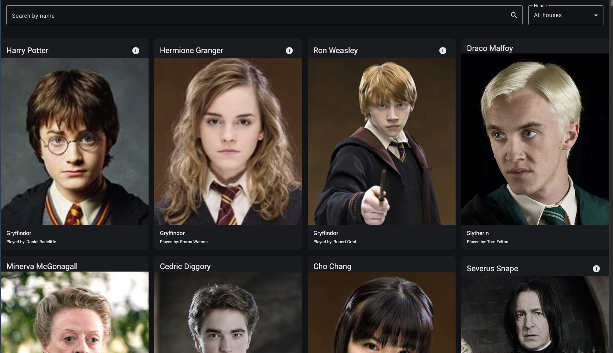
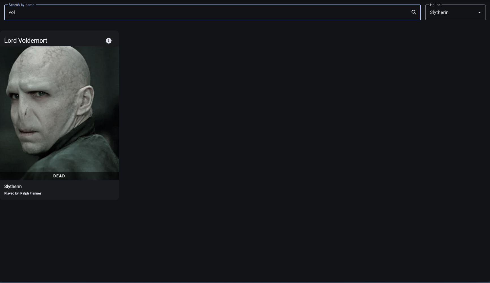
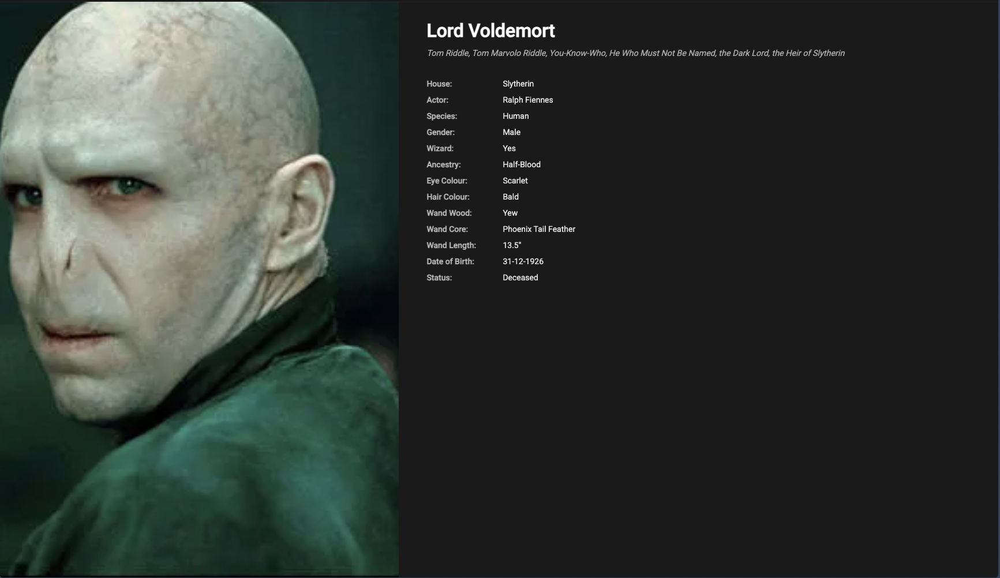

# 101480050LabTest2Comp3133
### by Eduard Kosenko, 101480050
This project was generated using [Angular CLI](https://github.com/angular/angular-cli) version 21.2.6.

## [Check live version]((https://pages.github.com/))

## Features
- Home screen showing character list, search bar and filtering
- Details screen showing more details about character
## Screenshots
Home Page

Search & Filter Demo

Details page



## Run the project

To start a local development server, run:

```bash
ng serve
```

Once the server is running, open your browser and navigate to `http://localhost:4200/`. The application will automatically reload whenever you modify any of the source files.